# Draft UI/UX — Hạ tầng số · Quản lý bảo trì đường bộ

> **Tài liệu dùng để duyệt thiết kế, chưa phải giao diện sản xuất.** Các hồ sơ, người dùng, KPI, số tiền, tiến độ và lớp nghiệp vụ do prototype đặt lên giao diện đều là dữ liệu minh họa. Riêng nền bản đồ và các lớp đang thấy bên trong Google My Maps đến từ liên kết công khai do người dùng cung cấp, có thể chứa dữ liệu tham chiếu thực. Không sử dụng tài liệu này làm căn cứ nghiệp vụ, pháp lý hoặc tài chính.

## 1. Mục tiêu vòng duyệt

Vòng draft này kiểm tra kiến trúc thông tin, mức độ dễ hiểu của luồng công việc và ngôn ngữ giao diện trước khi lập kế hoạch triển khai Next.js. Prototype tĩnh được đặt trong `ui-ux-draft`; không có backend, không gọi API nghiệp vụ và không ghi dữ liệu thật. Các vùng bản đồ online dùng iframe Google My Maps công khai không cần API key; bộ ảnh review dùng ảnh tham chiếu cục bộ được chụp từ chính map đó để kết quả ổn định. Mỗi frame có thể mở bằng URL `ui-ux-draft/index.html?screen=<MÃ_FRAME>&state=default`; script chụp tự thêm `capture=1`. Điều hướng giữa frame, tab, toast và một số thao tác cục bộ như retry được mô phỏng để hỗ trợ review; bảy kịch bản được duyệt bằng chuỗi URL ổn định, không phải một state machine nghiệp vụ hoàn chỉnh.

Các nguyên tắc xuyên suốt:

- Thiết kế theo **vai trò và ngoại lệ cần xử lý**, không biến dashboard thành tập hợp biểu đồ trang trí.
- Dùng chung bốn pattern: dashboard có drill-down, collection `Bản đồ | Bình đồ | Bảng`, detail workspace có lịch sử, và wizard/workbench có autosave.
- Sự cố là đầu vào của lệnh công việc; vị trí, bằng chứng và timeline được liên kết, không nhập lại.
- SCĐK và XDCB dùng chung Project Core, khác nhau qua mẫu và quy trình cấu hình.
- GIS, hồ sơ, cảnh báo, báo cáo, audit và phân quyền là năng lực nền tảng dùng chung.
- Mobile ưu tiên thao tác một tay, làm việc khi mất mạng và trạng thái đồng bộ ở từng bản ghi. “Đã lưu trên thiết bị” không đồng nghĩa “máy chủ đã nhận”.
- Cổng công khai chỉ đọc dataset đã được duyệt và lược bỏ dữ liệu nhạy cảm.
- Mọi chỉ số phải có kỳ dữ liệu, nguồn và khả năng drill-down; mọi hành động phải tuân theo vai trò, tổ chức, phạm vi tuyến/dự án và độ nhạy trường dữ liệu.

## 2. Design system dự kiến

| Thành phần | Quy ước draft |
|---|---|
| Phong cách | GovTech hiện đại, nghiêm túc, đáng tin cậy; nền sáng, viền nhẹ, ít bóng đổ |
| Màu | Navy cho điều hướng; blue cho hành động; teal cho ổn định/hoàn thành; amber/red chỉ cho cảnh báo và luôn có chữ/icon đi kèm |
| Chữ | Sans-serif hỗ trợ đầy đủ tiếng Việt; số liệu dùng tabular figures; phân cấp rõ giữa tiêu đề, nhãn và metadata |
| Mật độ | Desktop compact theo hệ khoảng cách 4/8 px; mobile thoáng hơn, mục tiêu chạm tối thiểu 44–48 px |
| Bố cục | Desktop `1440×1024`; mobile/PWA `390×844`; không tràn ngang ở hai viewport chuẩn |
| GIS | Google My Maps do người dùng cung cấp cho mọi vùng map; online dùng iframe tương tác, screenshot/offline dùng ảnh tham chiếu có nhãn rõ; bình đồ duỗi thẳng vẫn là component vector riêng |
| Trạng thái | Có chữ và icon cho `Mới`, `Chờ`, `Đang xử lý`, `Quá hạn`, `Có lỗi`, `Có xung đột`, `Đã đồng bộ`; không chỉ dùng màu |
| Tiếp cận | HTML ngữ nghĩa, nhãn form rõ, focus nhìn thấy, thao tác bàn phím, tương phản phù hợp và thông báo lỗi gắn với trường |

### 2.1. Nguồn bản đồ và giới hạn của draft

- **Bản đồ nguồn:** [2. Bản đồ phạm vi Văn phòng QLĐB IV.1](https://www.google.com/maps/d/viewer?mid=162tQYhvtsP6Em5ssfK6v2SnuCO3J94w&ll=11.482778221248616%2C108.04957928253076&z=9).
- **Endpoint nhúng:** `https://www.google.com/maps/d/embed?mid=162tQYhvtsP6Em5ssfK6v2SnuCO3J94w&ll=11.482778221248616,108.04957928253076&z=9&ehbc=2E312F`.
- Khi mở prototype bình thường, vùng map online tải iframe tương tác. Khi chụp review, `capture=1` dùng `ui-ux-draft/assets/google-mymaps-reference.png` để tránh tile tải dở giữa các frame.
- `M02` và `M04` chỉ **mô phỏng** nền map đã cache để duyệt UX offline; Google My Maps iframe không được xem là giải pháp bản đồ offline cho sản phẩm.
- Map đang được chia sẻ công khai nên chỉ phù hợp làm nguồn tham chiếu đã được chủ sở hữu cho phép. Dataset công bố trong sản phẩm vẫn phải có quy trình phê duyệt, lược bỏ dữ liệu nhạy cảm và chính sách lưu/cache riêng.
- Liên kết Google Sites người dùng cung cấp là URL `/edit`, chuyển tới trang đăng nhập Google khi truy cập ẩn danh. Muốn đối chiếu chính xác bố cục Site cần URL đã publish dạng `sites.google.com/view/...` hoặc ảnh chụp từ tài khoản có quyền.

## 3. Bộ frame desktop

### D01 — Dashboard lãnh đạo và ngoại lệ cần quyết định

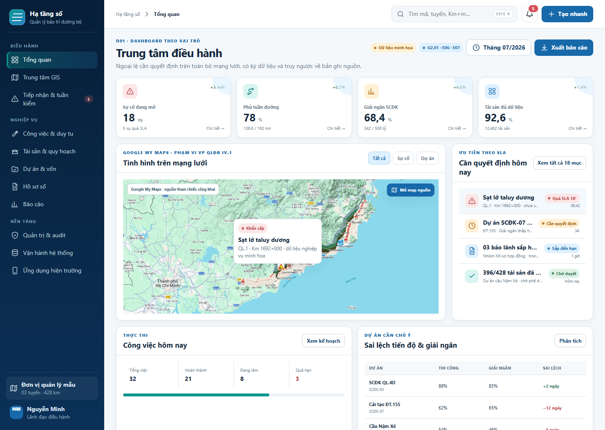

- **URL:** `ui-ux-draft/index.html?screen=D01&state=default`
- **Vai trò chính:** lãnh đạo/điều hành; dữ liệu tài chính chỉ xuất hiện khi có quyền.
- **Trạng thái minh họa:** kỳ báo cáo tháng 07/2026; có sự cố quá SLA, dự án chậm và hồ sơ cần quyết định.
- **Requirement ID:** `G2.01`, `E06`, `E07` (drill-down liên quan `B01`, `E03`, `E05`).
- **Dữ liệu:** KPI, ngoại lệ và callout là minh họa; nền địa hình, tuyến và cột Km lấy từ Google My Maps nguồn để bản đồ có ngữ cảnh thật.
- **Hành động chính:** đổi đơn vị/tuyến/kỳ; bấm KPI để mở tập bản ghi nguồn đã lọc; mở ngoại lệ; giao xử lý hoặc xem hồ sơ quyết định theo quyền.
- **Giả định cần xác nhận:** công thức KPI, kỳ khóa sổ, ngưỡng cảnh báo và phạm vi dữ liệu của từng cấp lãnh đạo đều là cấu hình, không hard-code.

### D02 — Trung tâm điều hành GIS trực tuyến

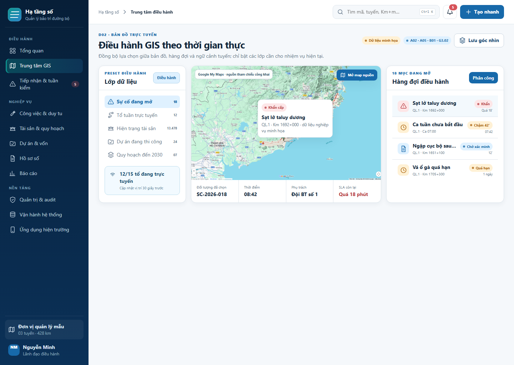

- **URL:** `ui-ux-draft/index.html?screen=D02&state=default`
- **Vai trò chính:** điều phối viên, đơn vị quản lý tuyến, cán bộ tuần kiểm.
- **Trạng thái minh họa:** online; preset `Điều hành`; một sự cố nghiêm trọng đang được chọn và hàng đợi có mục quá SLA.
- **Requirement ID:** `A02`, `A05`, `B01`, `G3.02`.
- **Dữ liệu:** Google My Maps cung cấp nền/lớp tuyến tham chiếu; vệt ca, trạng thái đối tượng, queue `Khẩn`, `Chờ xác minh`, `Ca chưa bắt đầu`, `Công việc chậm` là lớp UX minh họa.
- **Hành động chính:** tìm theo tuyến/Km+m/mã; bật layer preset; lọc theo thời gian và độ tin cậy; chọn đối tượng để đồng bộ highlight; xác nhận, phân công hoặc mở workspace chi tiết.
- **Giả định cần xác nhận:** tim tuyến, cách quy đổi Km+m, nhánh/chiều/làn, SLA và quyền theo đoạn quản lý phải đến từ cấu hình/dữ liệu chuẩn.

### D03 — Tài sản theo Bản đồ, Bình đồ và Bảng

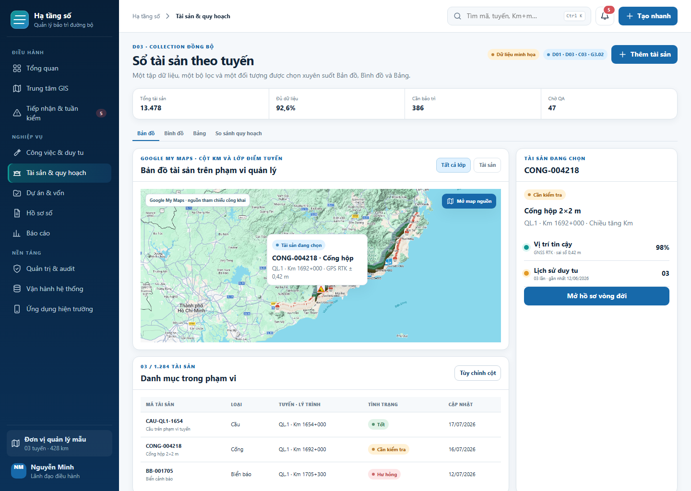

- **URL:** `ui-ux-draft/index.html?screen=D03&state=default`
- **Vai trò chính:** cán bộ tài sản/GIS, đơn vị quản lý tuyến, cán bộ bảo trì.
- **Trạng thái minh họa:** tab `Bản đồ` đang active; cùng tài sản `CONG-004218` xuất hiện trong callout, bảng và panel chi tiết; khi đổi sang `Bình đồ | Bảng` sẽ giữ nguyên bộ lọc và item được chọn.
- **Requirement ID:** `D01`, `D03`, `C03`, `G3.02`.
- **Dữ liệu:** Google My Maps hiển thị lớp tuyến/cột Km tham chiếu; tài sản, tình trạng, lý trình, lịch sử bảo trì và độ tin cậy vị trí là fixture minh họa của ứng dụng.
- **Hành động chính:** chuyển view; bật so sánh hiện trạng–quy hoạch; lọc theo loại/tình trạng; mở hồ sơ tài sản và timeline vòng đời.
- **Giả định cần xác nhận:** taxonomy tài sản, mô hình đoạn/điểm, ngày hiệu lực phiên bản và quy tắc hiển thị bình đồ cần thống nhất trước khi nhập dữ liệu thật.

### D04 — Hộp thư tiếp nhận, sự cố, vi phạm và tuần kiểm

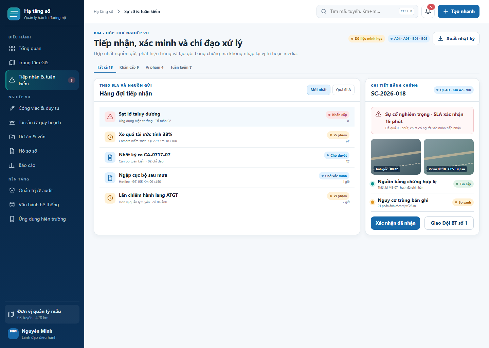

- **URL:** `ui-ux-draft/index.html?screen=D04&state=default`
- **Vai trò chính:** cán bộ trực, điều phối viên, cán bộ tuần kiểm.
- **Trạng thái minh họa:** danh sách trộn nhiều nguồn; một báo cáo chờ xác minh, một vi phạm cần chuyển cơ quan xử lý và một nhật ký cần duyệt.
- **Requirement ID:** `A04`, `A05`, `B01`, `B03`.
- **Dữ liệu minh họa:** nguồn gửi, mức độ, tuyến–Km+m, SLA, người phụ trách, ảnh gốc, độ chính xác GPS và trạng thái đồng bộ.
- **Hành động chính:** phân loại; phát hiện trùng; xác minh/từ chối; lập gói bằng chứng chuyển xử lý; giao việc; xem/xuất nhật ký theo mẫu có phiên bản.
- **Giả định cần xác nhận:** thẩm quyền xác minh, nơi nhận vi phạm, SLA theo loại/mức độ và mẫu nhật ký là dữ liệu cấu hình có lịch sử hiệu lực.

### D05 — Lệnh công việc, nghiệm thu không đạt và trả làm lại

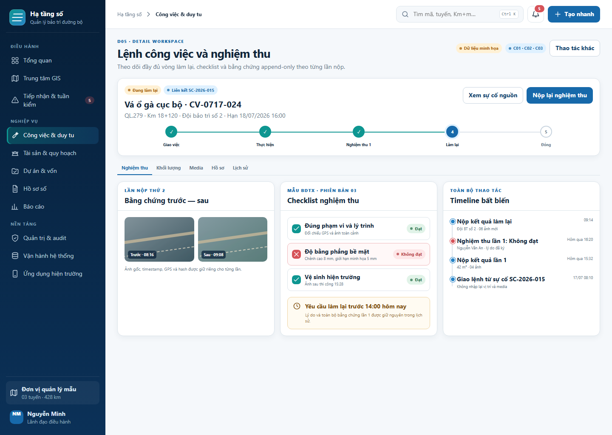

- **URL:** `ui-ux-draft/index.html?screen=D05&state=default`
- **Vai trò chính:** điều phối, đội BDTX/nhà thầu, giám sát và cán bộ nghiệm thu.
- **Trạng thái minh họa:** lệnh đã nộp kết quả, lần nghiệm thu 1 `Không đạt`, đang ở vòng `Làm lại`; bằng chứng trước–sau của cả hai lần được giữ riêng.
- **Requirement ID:** `C01`, `C02`, `C03`.
- **Dữ liệu minh họa:** lệnh liên kết sự cố nguồn, khối lượng, hạn, đội thực hiện, checklist, media, chữ ký/hash giả lập và timeline append-only.
- **Hành động chính:** theo dõi tiến độ; xem bằng chứng nguồn; chấm checklist; nhập lý do không đạt; trả làm lại; nghiệm thu đạt và đóng; xem lịch sử duy tu của tài sản.
- **Giả định cần xác nhận:** checklist, người ký, yêu cầu chứng từ và điều kiện `Đạt/Không đạt/Mở lại` phải được chốt theo loại công việc và biểu mẫu có phiên bản.

### D06 — QA tài sản, biên tập GIS và duyệt công bố

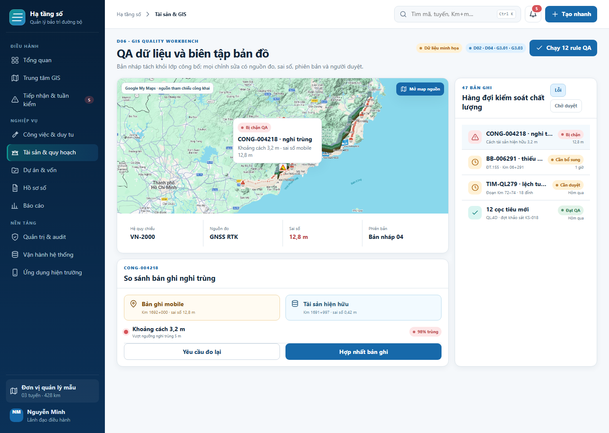

- **URL:** `ui-ux-draft/index.html?screen=D06&state=default`
- **Vai trò chính:** biên tập viên GIS, kiểm soát chất lượng, người duyệt công bố.
- **Trạng thái minh họa:** một cập nhật mobile bị chặn do GPS sai số cao/nghi trùng; bản nháp GIS chưa nằm trong lớp đã công bố.
- **Requirement ID:** `D02`, `D04`, `G3.01`, `G3.03`.
- **Dữ liệu:** nền Google My Maps là tham chiếu không gian; hình học trước/sau, hệ tọa độ, nguồn đo, sai số, điểm snap, trùng tiềm năng và lịch sử phiên bản là fixture QA minh họa.
- **Hành động chính:** so sánh; hợp nhất hoặc giữ riêng; yêu cầu đo lại; chỉnh hình học; chạy rule QA; gửi duyệt; công bố hoặc từ chối có lý do.
- **Giả định cần xác nhận:** hệ quy chiếu chuẩn, ngưỡng sai số, thiết bị GNSS/RTK, rule phát hiện trùng và nguyên tắc hai người biên tập–duyệt.

### D07 — Project Core dùng chung cho SCĐK và XDCB

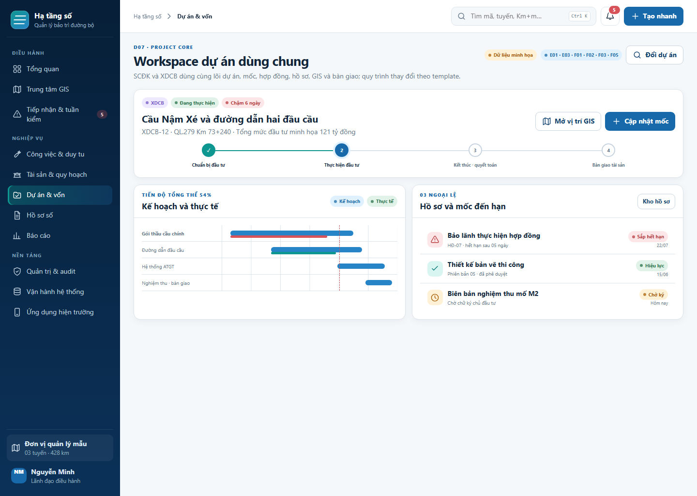

- **URL:** `ui-ux-draft/index.html?screen=D07&state=default`
- **Vai trò chính:** chủ đầu tư/BQLDA, cán bộ kế hoạch, cán bộ kỹ thuật và pháp chế dự án.
- **Trạng thái minh họa:** dự án đang thực hiện; mốc thực tế trễ kế hoạch; một hồ sơ pháp lý sắp hết hạn.
- **Requirement ID:** `E01`, `E03`, `F01`, `F02`, `F03`, `F05`.
- **Dữ liệu minh họa:** loại dự án SCĐK/XDCB, phạm vi tuyến trên GIS, stage gate, milestone, hợp đồng, hồ sơ pháp lý, hạn thủ tục/bảo hành và timeline.
- **Hành động chính:** đổi tab tổng quan–tiến độ–GIS–hồ sơ; cập nhật mốc; xem chênh lệch; liên kết tài liệu; xử lý cảnh báo; chuyển gate theo quyền.
- **Giả định cần xác nhận:** gate, thẩm quyền duyệt, loại hồ sơ và mốc bắt buộc là template theo loại dự án; không tạo hai hệ thống dự án tách biệt.

### D08 — Vốn, khối lượng, thanh toán và giải ngân

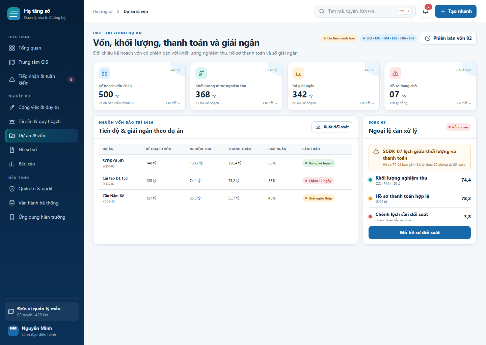

- **URL:** `ui-ux-draft/index.html?screen=D08&state=default`
- **Vai trò chính:** kế hoạch/tài chính, BQLDA, người duyệt thanh toán và lãnh đạo có thẩm quyền.
- **Trạng thái minh họa:** dự án chậm; khối lượng nghiệm thu không khớp hồ sơ thanh toán; giải ngân thấp hơn kế hoạch.
- **Requirement ID:** `E02`, `E03`, `E04`, `E05`, `E06`, `E07`.
- **Dữ liệu minh họa:** kế hoạch và điều chỉnh vốn theo năm/nguồn, BOQ, khối lượng, tạm ứng, hồ sơ thanh toán, số đã giải ngân và exception đối soát.
- **Hành động chính:** chọn kỳ/nguồn; xem version kế hoạch vốn; đối chiếu bốn lớp số liệu; mở chứng từ; ghi nhận/giải trình sai lệch; chuyển duyệt theo quyền.
- **Giả định cần xác nhận:** công thức giải ngân, nguồn số liệu chính thức, kỳ khóa sổ, tỷ lệ thu hồi tạm ứng và cấp duyệt không được suy diễn từ dữ liệu minh họa.

### D09 — Bàn giao dự án sang cơ sở dữ liệu tài sản

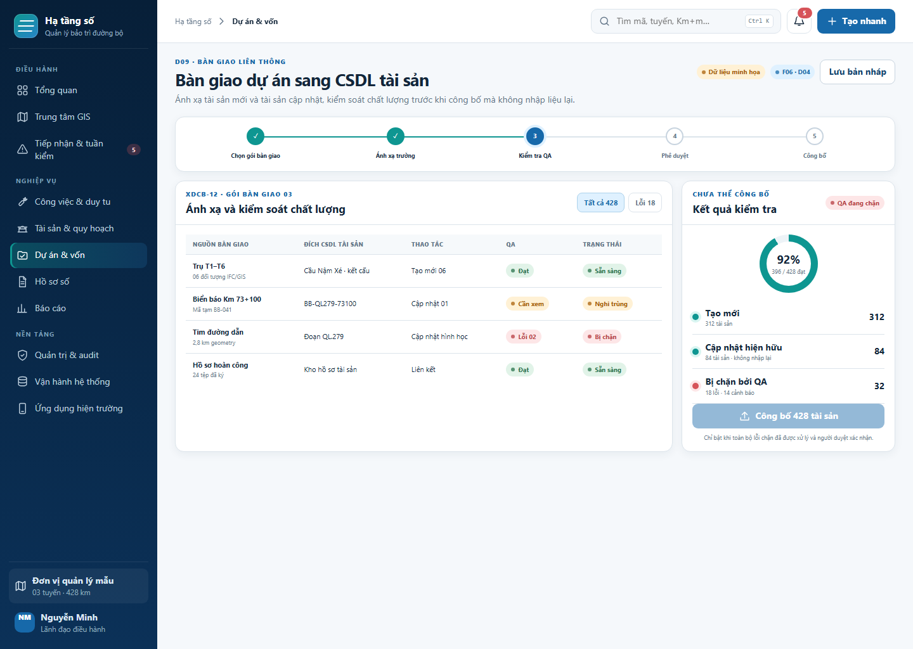

- **URL:** `ui-ux-draft/index.html?screen=D09&state=default`
- **Vai trò chính:** BQLDA, cán bộ tài sản/GIS, kiểm soát dữ liệu và người duyệt bàn giao.
- **Trạng thái minh họa:** gói hoàn thành có tài sản mới và tài sản hiện hữu cần cập nhật; một dòng lỗi mapping đang chặn công bố.
- **Requirement ID:** `F06` (liên kết kiểm soát với `D04`, `G3.03`).
- **Dữ liệu minh họa:** nguồn dự án, mapping trường, mã tạm, ứng viên tài sản hiện hữu, hình học, hồ sơ hoàn công, rule QA và biên nhận bàn giao.
- **Hành động chính:** map trường; xác nhận tạo mới/cập nhật; giải quyết trùng; chạy validation; gửi duyệt; công bố phiên bản tài sản mà không nhập lại.
- **Giả định cần xác nhận:** chủ sở hữu dữ liệu sau bàn giao, chiến lược sinh mã, trường bắt buộc, xử lý sai lệch hình học và tiêu chí đóng dự án.

### D10 — Kho hồ sơ số và mượn–trả hồ sơ gốc

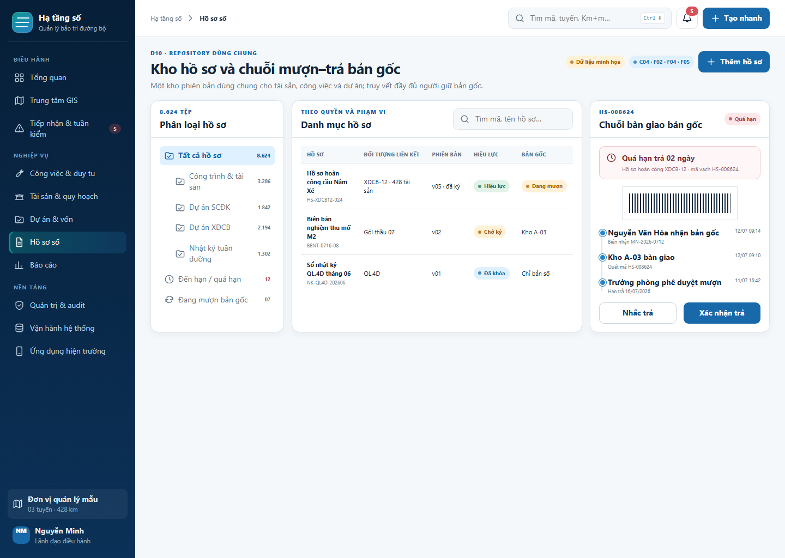

- **URL:** `ui-ux-draft/index.html?screen=D10&state=default`
- **Vai trò chính:** văn thư/kho hồ sơ, người mượn, người duyệt và kiểm toán viên.
- **Trạng thái minh họa:** hồ sơ số có nhiều phiên bản; một hồ sơ gốc đang mượn và đã quá hạn trả.
- **Requirement ID:** `C04`, `F02`, `F04`, `F05`.
- **Dữ liệu minh họa:** barcode, vị trí kệ, phiên bản file, checksum/chữ ký giả lập, người giữ hiện tại, lịch hẹn, nhắc hạn và chuỗi bàn giao.
- **Hành động chính:** tìm/preview; tải phiên bản theo quyền; tạo yêu cầu mượn; duyệt; quét giao–nhận–trả; gia hạn; mở audit chain.
- **Giả định cần xác nhận:** quy định lưu trữ, thời hạn, hồ sơ được phép số hóa/tải xuống, người phê duyệt và giá trị pháp lý của ký nhận điện tử.

### D11 — Báo cáo, trình tạo báo cáo và thư viện biểu mẫu

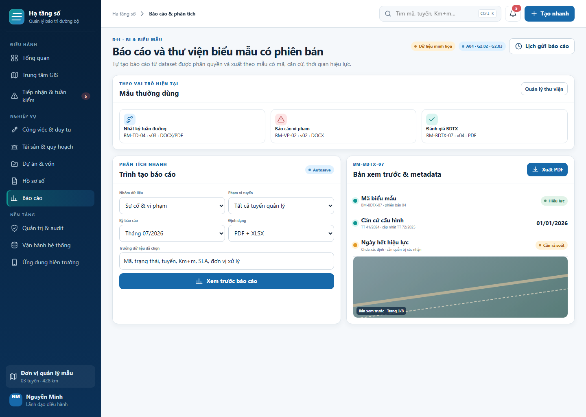

- **URL:** `ui-ux-draft/index.html?screen=D11&state=default`
- **Vai trò chính:** cán bộ nghiệp vụ, phân tích, quản trị biểu mẫu và lãnh đạo.
- **Trạng thái minh họa:** đang preview báo cáo từ dataset đã chọn; thư viện có bản mẫu đang hiệu lực và bản thay thế trong tương lai.
- **Requirement ID:** `A04`, `G2.02`, `G2.03`.
- **Dữ liệu minh họa:** dataset, trường, bộ lọc, nhóm, lịch chạy, mã mẫu, căn cứ, ngày hiệu lực/hết hiệu lực, phạm vi và định dạng xuất.
- **Hành động chính:** kéo/chọn trường; preview; lưu báo cáo; lên lịch; chọn đúng phiên bản mẫu theo ngày; xuất PDF/XLSX/CSV giả lập và xem lịch sử xuất.
- **Giả định cần xác nhận:** danh sách dataset được phép, chống suy diễn dữ liệu nhạy cảm, mẫu pháp lý hiện hành và quyền xuất số lượng lớn.

### D12 — Cổng bản đồ công khai cho người dân

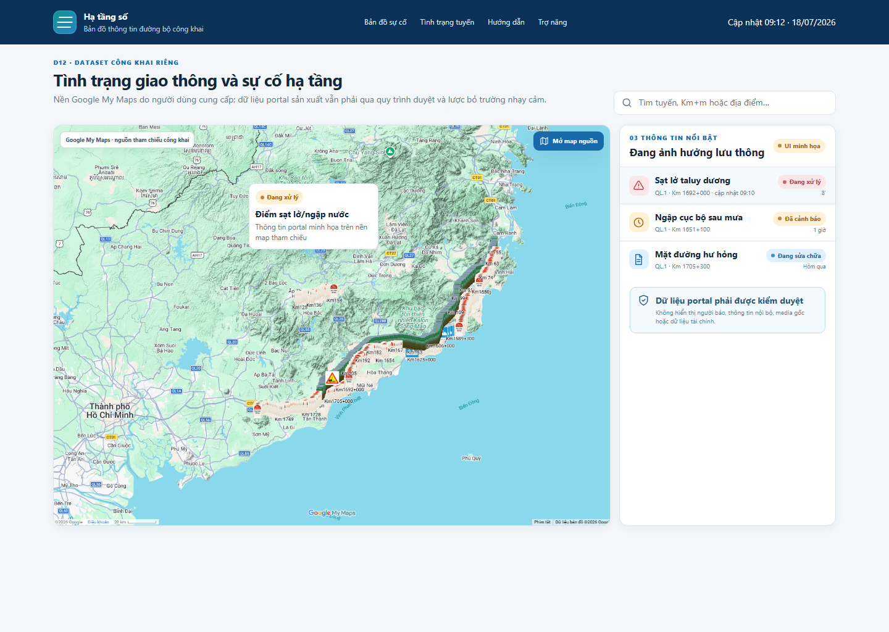

- **URL:** `ui-ux-draft/index.html?screen=D12&state=default`
- **Vai trò chính:** người dân/khách không đăng nhập; quản trị công bố chỉ xuất hiện ở hệ thống nội bộ.
- **Trạng thái minh họa:** shell portal đặt trên Google My Maps công khai do người dùng cung cấp; danh sách sự cố bên phải là fixture đã lược trường để duyệt UI, chưa phải bằng chứng dataset sản xuất đã được duyệt.
- **Requirement ID:** `B02`, `G6.02`.
- **Dữ liệu:** nền/lớp trong iframe thuộc map tham chiếu công khai; phạm vi ảnh hưởng, trạng thái xử lý và thời điểm cập nhật ở panel portal là dữ liệu minh họa.
- **Hành động chính:** tìm tuyến/địa danh; lọc lớp công khai; mở chi tiết; xem chú giải và thời điểm dữ liệu. Draft chưa có chức năng gửi phản ánh.
- **Giả định cần xác nhận:** quyền tái sử dụng từng lớp My Maps, bộ trường công khai, độ trễ xuất bản, quy trình gỡ/sửa, tuyên bố miễn trừ và việc người dân chỉ xem hay được gửi phản ánh.

### D13 — Vai trò, phạm vi dữ liệu, dữ liệu nhạy cảm và audit

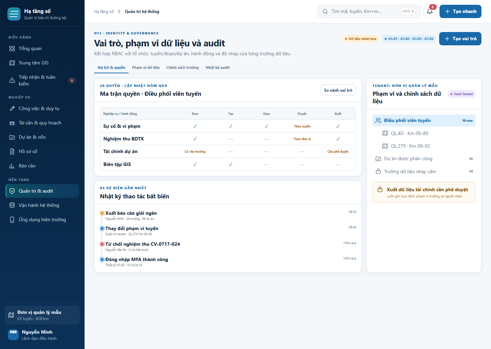

- **URL:** `ui-ux-draft/index.html?screen=D13&state=default`
- **Vai trò chính:** quản trị hệ thống, quản trị dữ liệu, an toàn thông tin và kiểm toán.
- **Trạng thái minh họa:** một vai trò có phạm vi theo tuyến/dự án; trường tài chính bị che; một lần xuất nhạy cảm được ghi audit.
- **Requirement ID:** `G1.01`, `G1.02`, `G1.03`, `G7.02`.
- **Dữ liệu minh họa:** ma trận vai trò–hành động, cây tổ chức/phạm vi, field policy, điều kiện xuất, timeline bất biến và diff trước/sau.
- **Hành động chính:** xem/chỉnh bản nháp quyền; gán phạm vi; mô phỏng quyền hiệu lực; duyệt policy; tra audit; xem lý do truy cập/xuất dữ liệu nhạy cảm.
- **Giả định cần xác nhận:** cơ cấu tổ chức, vai trò thực tế, nguyên tắc tách nhiệm vụ, MFA, retention audit và cấp phê duyệt xuất nhạy cảm.

### D14 — Thông báo, cảnh báo, tích hợp, chia sẻ dữ liệu và backup

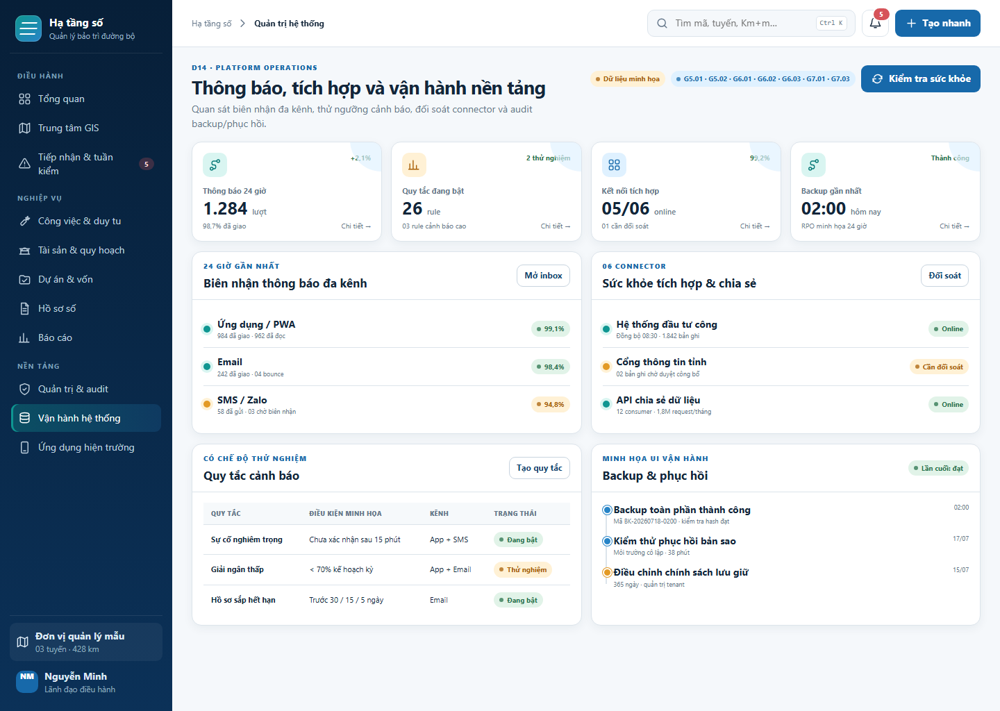

- **URL:** `ui-ux-draft/index.html?screen=D14&state=default`
- **Vai trò chính:** quản trị nền tảng/tenant, vận hành tích hợp, quản trị cảnh báo và an toàn hệ thống.
- **Trạng thái minh họa:** một connector lỗi đối soát, một kênh gửi chậm, backup gần nhất thành công và lần khôi phục thử có audit.
- **Requirement ID:** `G5.01`, `G5.02`, `G6.01`, `G6.02`, `G6.03`, `G7.01`, `G7.03`.
- **Dữ liệu minh họa:** inbox đa kênh, biên nhận app/email/SMS/Zalo, rule/threshold, connector đầu tư công/cổng tỉnh, API dataset, backup và tenant.
- **Hành động chính:** xem delivery receipt; test rule không gửi thật; retry/đối soát connector; quản lý quyền API; xem lịch backup; tạo yêu cầu restore theo quy trình.
- **Giả định cần xác nhận:** tenant model, kênh thực tế, SLA tích hợp, chuẩn API, rate limit, RPO/RTO và quy trình restore có phê duyệt.

## 4. Bộ frame mobile/PWA

### M01 — Trang chủ hiện trường và gói dữ liệu tuyến offline

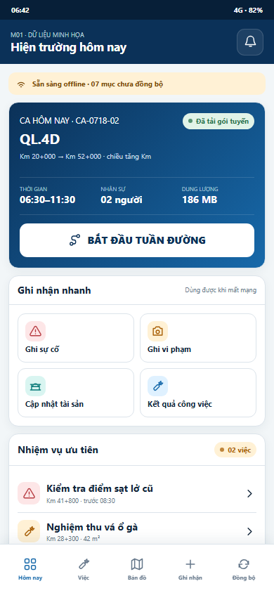

- **URL:** `ui-ux-draft/index.html?screen=M01&state=default`
- **Vai trò chính:** nhân viên tuần đường; home thích ứng theo vai trò cho cán bộ tuần kiểm/đội thi công.
- **Trạng thái minh họa:** online nhưng có 7 mục chưa đồng bộ; gói tuyến hôm nay đã tải và còn hiệu lực.
- **Requirement ID:** `A01`, `A05`, `G4.01`, `G4.02`, `G7.03`.
- **Dữ liệu minh họa:** ca hôm nay, đoạn tuyến, dung lượng/thời điểm gói offline, nhiệm vụ ưu tiên, bản nháp và lỗi đồng bộ.
- **Hành động chính:** tải/cập nhật gói tuyến; bắt đầu ca; ghi nhanh sự cố/vi phạm/tài sản/kết quả việc; mở sync queue.
- **Giả định cần xác nhận:** dung lượng gói, chính sách hết hạn, vùng mất mạng, thiết bị/OS và cách khóa/xóa cache khi thu hồi thiết bị.

### M02 — Ca tuần đang chạy và ghi sự cố khẩn khi mất mạng

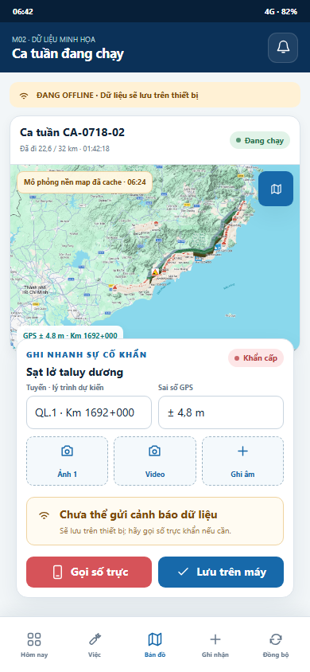

- **URL:** `ui-ux-draft/index.html?screen=M02&state=default`
- **Vai trò chính:** nhân viên tuần đường.
- **Trạng thái minh họa:** `OFFLINE`; tracking chỉ bật trong ca; GPS có sai số; sự cố khẩn đã lưu trên máy nhưng chưa có biên nhận máy chủ.
- **Requirement ID:** `A01`, `A02`, `A03`, `G4.02`.
- **Dữ liệu minh họa:** thời lượng/đoạn đã đi, vệt GPS, Km+m dự kiến, độ chính xác, ảnh/video, thời gian thiết bị và trạng thái upload; nền map là ảnh tham chiếu từ My Maps có nhãn `Mô phỏng nền map đã cache`.
- **Hành động chính:** tạm dừng/kết thúc ca; ghi nhanh; sửa vị trí kèm lý do; lưu bản nháp; dùng kênh gọi dự phòng khi cảnh báo khẩn chưa gửi được.
- **Giả định cần xác nhận:** nhà cung cấp basemap/tiles được phép cache offline, dung lượng và thời hạn cache, tần suất tracking, retention, điều kiện hoàn thành ca, số media/tệp, số điện thoại/kênh dự phòng và quy tắc cảnh báo khẩn.

### M03 — Việc của tôi, chỉ đạo tuần kiểm và báo khối lượng

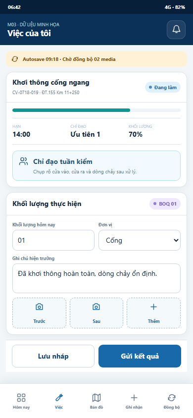

- **URL:** `ui-ux-draft/index.html?screen=M03&state=default`
- **Vai trò chính:** cán bộ tuần kiểm hoặc đội BDTX/nhà thầu; nội dung thay đổi theo vai trò.
- **Trạng thái minh họa:** có chỉ đạo ưu tiên và một lệnh đang làm lại; báo khối lượng được autosave.
- **Requirement ID:** `A05`, `C01`, `E04`, `G4.01`.
- **Dữ liệu minh họa:** việc theo hạn/mức độ, chỉ đạo, BOQ, khối lượng kỳ này/lũy kế, ảnh trước–sau, vị trí và chữ ký giả lập.
- **Hành động chính:** nhận việc; mở chỉ đường; cập nhật tiến độ; nhập khối lượng; đính kèm bằng chứng; gửi kết quả hoặc bổ sung theo yêu cầu.
- **Giả định cần xác nhận:** ai được sửa BOQ/khối lượng, tolerance, chứng cứ tối thiểu, chữ ký và ranh giới thao tác mobile của từng vai trò.

### M04 — Cập nhật tài sản khi GPS sai số cao hoặc nghi trùng

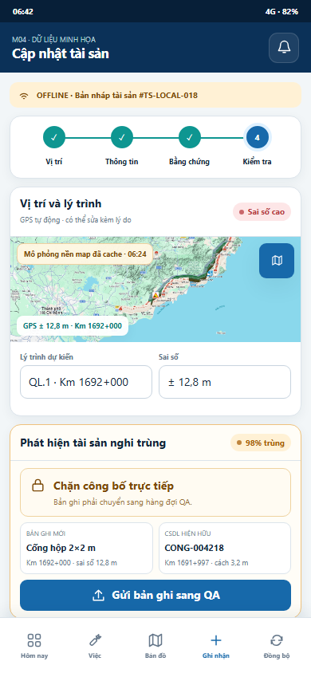

- **URL:** `ui-ux-draft/index.html?screen=M04&state=default`
- **Vai trò chính:** cán bộ khảo sát/tài sản hiện trường.
- **Trạng thái minh họa:** wizard offline cảnh báo sai số GPS cao và tìm thấy tài sản tương tự gần vị trí; không cho hiển thị như đã công bố.
- **Requirement ID:** `D02`, `D04`, `G4.01`, `G4.02`.
- **Dữ liệu minh họa:** tuyến/Km+m tự tính, tọa độ, sai số, nguồn đo, ảnh, thuộc tính tài sản, ứng viên trùng và lý do hiệu chỉnh; nền map là ảnh tham chiếu offline từ My Maps.
- **Hành động chính:** đo lại; chọn tài sản hiện hữu hoặc tạo ứng viên mới; sửa snap kèm lý do; lưu offline; gửi sang hàng đợi QA.
- **Giả định cần xác nhận:** giải pháp bản đồ offline hợp lệ, ngưỡng sai số/chặn, bán kính phát hiện trùng, thuộc tính bắt buộc, thiết bị độ chính xác cao và quyền hợp nhất.

### M05 — Hàng đợi đồng bộ, retry, conflict và biên nhận máy chủ

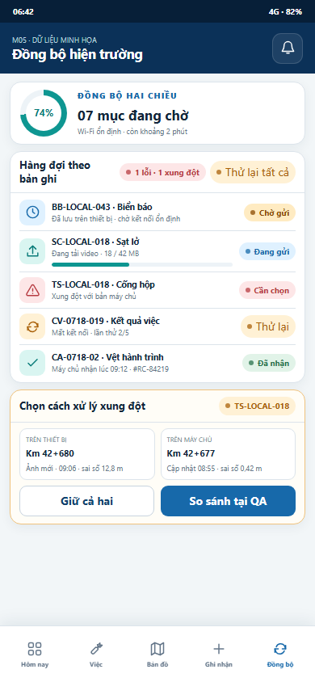

- **URL:** `ui-ux-draft/index.html?screen=M05&state=default`
- **Vai trò chính:** mọi người dùng hiện trường; hỗ trợ kỹ thuật chỉ xem khi được cấp quyền.
- **Trạng thái minh họa:** có bản ghi `Chờ gửi`, media `Đang tải`, một lỗi có thể retry, một xung đột trường lõi và một bản ghi đã có biên nhận.
- **Requirement ID:** `G4.02` (kiểm chứng hành vi của `A03`, `D02`, `E04`).
- **Dữ liệu minh họa:** ID sinh trên thiết bị, thời gian thiết bị/máy chủ, tiến độ media, số lần retry, diff thiết bị–máy chủ và receipt ID.
- **Hành động chính:** retry từng mục/tất cả; xem lỗi; tiếp tục upload; so sánh xung đột; chọn/ghép theo quyền; lưu biên nhận.
- **Giả định cần xác nhận:** chiến lược merge theo loại bản ghi, giới hạn retry, xử lý media hỏng, thời gian giữ queue và trường nào bắt buộc chuyển về QA.

## 5. Ma trận bao phủ đủ 48 chức năng

Ma trận dưới đây giữ nguyên ID nguồn. Tổng kiểm đếm: `A 5 + B 3 + C 4 + D 4 + E 7 + F 6 + G 19 = 48`.

| ID | Chức năng nguồn | Frame kiểm chứng | Biểu hiện trong draft |
|---|---|---|---|
| A01 | Khai báo vị trí tuần đường, tự xác định vị trí/lý trình/địa chỉ, chụp ảnh, không cần mạng | M01, M02 | Gói tuyến offline, bắt đầu ca, GPS/Km+m và quick capture |
| A02 | Theo dõi lịch trình, thời gian, địa điểm, nhân sự | D02, M02 | Live map/vệt ca, timeline và thông tin người thực hiện |
| A03 | Ghi kết quả tuần đường bằng mobile, ảnh/video, cảnh báo khẩn | M02, M05 | Ghi nhanh, media, cảnh báo khẩn queued và biên nhận sau sync |
| A04 | Xuất sổ nhật ký tuần đường theo mẫu | D04, D11 | Preview nhật ký và mẫu có phiên bản |
| A05 | Tuần kiểm trên mobile, tiếp nhận/chỉ đạo xử lý | D02, D04, M01, M03 | Queue tuần kiểm, chỉ đạo và việc theo vai trò |
| B01 | Theo dõi sự cố kết cấu hạ tầng trực tuyến | D02, D04 | Map/list sự cố, SLA và workspace xác minh |
| B02 | Bản đồ sự cố công khai cho người dân | D12 | Public map dùng dataset đã duyệt/lược bỏ trường nhạy cảm |
| B03 | Tiếp nhận/báo cáo vi phạm cho cơ quan xử lý | D04 | Intake, kiểm chứng bằng chứng và gói chuyển xử lý |
| C01 | Danh mục và tiến độ công việc duy tu | D05, M03 | Danh sách/lệnh, trạng thái, hạn và tiến độ hiện trường |
| C02 | Đánh giá kết quả duy tu bảo dưỡng | D05 | Checklist nghiệm thu, không đạt và làm lại |
| C03 | Tra cứu lịch sử duy tu theo vòng đời công trình | D03, D05 | Timeline tài sản và liên kết các lần công việc/nghiệm thu |
| C04 | Hồ sơ số và mượn–trả hồ sơ gốc | D10 | Repository, phiên bản, barcode và chain of custody |
| D01 | Hiện trạng tài sản trên bản đồ và bình đồ duỗi thẳng | D03 | Ba view đồng bộ `Bản đồ | Bình đồ | Bảng` |
| D02 | Cập nhật tài sản bằng mobile, tự tính lý trình | M04, D06 | Wizard mobile, Km+m dự kiến, duplicate check và QA |
| D03 | Quản lý quy hoạch tích hợp hiện trạng | D03, D06 | Layer quy hoạch, compare và quy trình công bố |
| D04 | Thu thập CSDL tài sản độ chính xác cao | M04, D06 | Metadata đo, đợt khảo sát và quality queue |
| E01 | Danh mục dự án SCĐK gắn bản đồ | D07 | Project Core, bộ lọc loại SCĐK và phạm vi GIS |
| E02 | Kế hoạch/phân bổ vốn theo năm và nguồn | D08 | Financial grid và lịch sử phiên bản kế hoạch vốn |
| E03 | Tiến độ thi công theo mốc, kế hoạch–thực tế | D07, D08 | Milestone và sai lệch kế hoạch–thực tế |
| E04 | Cập nhật khối lượng nghiệm thu ngoài hiện trường | M03, D08 | BOQ entry có bằng chứng và đối chiếu tài chính |
| E05 | Hồ sơ thanh toán, tạm ứng, giải ngân | D08 | Payment workbench và liên kết chứng từ |
| E06 | Dashboard tỷ lệ giải ngân | D01, D08 | KPI có kỳ/nguồn và drill-down về hồ sơ nguồn |
| E07 | Cảnh báo chậm tiến độ/chậm giải ngân | D01, D08 | Exception queue và giải trình/escalation |
| F01 | Quản lý vòng đời dự án XDCB | D07 | Stage-gate workspace dùng template XDCB |
| F02 | Hồ sơ pháp lý dự án tập trung | D07, D10 | Tab pháp lý liên kết kho hồ sơ có phiên bản |
| F03 | Liên kết hồ sơ dự án với GIS | D07 | Tab vị trí/phạm vi tuyến và tài liệu liên quan |
| F04 | Mượn–trả hồ sơ gốc dự án | D10 | Approval, barcode và chuỗi giao nhận |
| F05 | Cảnh báo hạn hồ sơ, thủ tục, bảo hành, hợp đồng | D07, D10 | Due-date queue, nhắc hạn và trạng thái xử lý |
| F06 | Chuyển dữ liệu hoàn thành sang CSDL tài sản | D09 | Mapping, QA, duyệt và publish không nhập lại |
| G1.01 | Phân quyền theo vai trò | D13 | Permission matrix và bản nháp policy |
| G1.02 | Phân quyền theo phạm vi tuyến/khu vực | D13 | Scope tree/map theo tổ chức, tuyến và dự án |
| G1.03 | Nhật ký thao tác người dùng | D13 | Audit timeline có diff, người và thời gian |
| G2.01 | Dashboard tổng hợp cho lãnh đạo | D01 | Dashboard theo vai trò, ngoại lệ và drill-down |
| G2.02 | Tự tạo báo cáo tùy biến | D11 | Dataset/field/filter builder và preview |
| G2.03 | Xuất báo cáo theo mẫu, nhiều định dạng | D11 | Template/version/export center |
| G3.01 | Một hệ tọa độ/CSDL không gian dùng chung | D06 | Cấu hình hệ quy chiếu và metadata/QA không gian |
| G3.02 | Chồng lớp hiện trạng–quy hoạch–sự cố–dự án | D02, D03 | Layer manager, preset và compare |
| G3.03 | Biên tập/cập nhật dữ liệu bản đồ | D06 | Map editor, review và publish có phiên bản |
| G4.01 | Một app mobile dùng chung cho nghiệp vụ hiện trường | M01, M03, M04 | Mobile shell thích ứng theo vai trò và quick actions |
| G4.02 | Đồng bộ hai chiều sau khi offline | M01, M02, M04, M05 | Sync state từng bản ghi, retry, conflict và receipt |
| G5.01 | Notification chung qua app/email/SMS/Zalo | D14 | Unified inbox, delivery state và receipt |
| G5.02 | Cấu hình ngưỡng cảnh báo | D14 | Rule builder có test mode và lịch sử phiên bản |
| G6.01 | API hệ thống đầu tư công/mua sắm công | D14 | Connector health, retry và reconciliation |
| G6.02 | Kết nối cổng dịch vụ công/cổng tỉnh | D12, D14 | Publication connector và public dataset |
| G6.03 | Chia sẻ dữ liệu cho hệ thống khác | D14 | Dataset/API permission center |
| G7.01 | Sao lưu và phục hồi định kỳ | D14 | Backup status và restore audit |
| G7.02 | Quyền truy cập dữ liệu nhạy cảm | D13 | Field/action policy, masking và export log |
| G7.03 | SaaS, truy cập web và mobile | D14, M01 | Tenant configuration và web/PWA shell |

## 6. Bảy kịch bản bắt buộc để duyệt UX

Các kịch bản này là tiêu chí duyệt, không chỉ là nội dung trang trí trong screenshot.

| # | Kịch bản | Chuỗi frame | Điều kiện chấp nhận ở vòng draft |
|---:|---|---|---|
| 1 | Nhân viên tuần đường hoàn thành ca khi mất mạng, ghi một sự cố và đồng bộ lại sau đó | M01 → M02 → M05 → D04 | Mobile nói rõ “đã lưu trên thiết bị”; lưu được ca/sự cố/media; retry được; chỉ hiển thị “máy chủ đã nhận” sau khi có receipt; desktop thấy đúng bản ghi và nguồn gốc |
| 2 | Sự cố nghiêm trọng được cảnh báo, có người xác nhận đã nhận, phân công và xử lý đúng SLA | M02 → D04 → D02 → D05 → D14 | Cảnh báo offline có kênh dự phòng; khi online có delivery/ack; điều phối xác minh và giao việc; SLA/timeline theo suốt luồng, không nhập lại vị trí/bằng chứng |
| 3 | Lệnh duy tu bị nghiệm thu không đạt, trả làm lại và giữ đầy đủ hai lần bằng chứng | M03 → D05 | Lý do không đạt bắt buộc; vòng làm lại tách biệt; giữ ảnh/checklist/người/thời gian của cả hai lần; chỉ đóng sau lần nghiệm thu đạt |
| 4 | Cập nhật tài sản có GPS sai số cao hoặc nghi trùng; hệ thống chặn công bố và đưa sang QA | M04 → M05 → D06 → D03 | Hiển thị sai số và điểm snap; người dùng không được hiểu là đã công bố; conflict/duplicate không ghi đè; QA so sánh và duyệt phiên bản trước khi xuất hiện ở lớp chính thức |
| 5 | Dự án chậm tiến độ; đối chiếu kế hoạch vốn, khối lượng nghiệm thu, hồ sơ thanh toán và số đã giải ngân | D01 → D07 → D08 | Từ ngoại lệ drill-down đến dự án; xem được kế hoạch–thực tế, bốn lớp số liệu và chứng từ; công thức/kỳ/nguồn KPI được trình bày, sai lệch có người xử lý |
| 6 | Dự án hoàn thành bàn giao nhiều tài sản mới và cập nhật tài sản hiện hữu mà không nhập lại | D07 → D09 → D06 → D03 | Mapping phân biệt tạo mới/cập nhật; lỗi một dòng không bị bỏ qua; có QA/duyệt/receipt; tài sản công bố giữ nguồn dự án và lịch sử phiên bản |
| 7 | Hồ sơ gốc được mượn, nhắc quá hạn, trả lại và truy được toàn bộ chuỗi bàn giao | D10 → D14 → D10 | Có yêu cầu/duyệt/quét giao; nhắc quá hạn có delivery state; quét trả; audit thể hiện đầy đủ từng người, thời gian, trạng thái và vị trí lưu mới |

## 7. Giả định và quyết định cần xác nhận

Các lựa chọn dưới đây chỉ là mặc định của draft; cần được stakeholder xác nhận trước khi lập kế hoạch sản xuất:

1. Mobile là Next.js PWA dùng chung, không phải ứng dụng native riêng.
2. Tên tạm của sản phẩm là **“Hạ tầng số — Quản lý bảo trì đường bộ”**; chưa gắn thương hiệu/tên cơ quan.
3. Chưa chốt mô hình một đơn vị, một tỉnh, nhiều Khu QLĐB hay SaaS nhiều tenant.
4. Chưa chốt cơ cấu vai trò và RACI: ai giao, ai duyệt, ai nghiệm thu, ai mở lại, ai xuất dữ liệu nhạy cảm.
5. Chưa chốt tim tuyến/hệ quy chiếu, quy đổi Km+m, chiều/làn/nhánh, ngưỡng GPS và quy trình GNSS/RTK.
6. Chưa chốt state machine, SLA, escalation, checklist nghiệm thu, bằng chứng/chữ ký/hash và thời gian lưu giữ.
7. Chưa chốt công thức KPI, nguồn chứng từ chính thức, kỳ khóa sổ và cách điều chỉnh vốn.
8. Biểu mẫu/quy định phải có mã, căn cứ, phiên bản, ngày hiệu lực/hết hiệu lực và phạm vi; không hard-code nội dung pháp lý từ draft.
9. Cổng công khai hiện chỉ cho xem dataset được duyệt; chưa bao gồm gửi phản ánh của người dân.
10. API, notification, backup, SaaS và restore chỉ mô tả UX quản trị, không phải bằng chứng rằng kiến trúc đã được triển khai hoặc nghiệm thu.
11. Google My Maps hiện chỉ là nguồn hình ảnh/tương tác cho draft online. Trước production phải xác nhận quyền sử dụng lớp dữ liệu, lựa chọn map provider, quota, bảo mật, accessibility và cơ chế offline/cache hợp lệ.

## 8. Prompt copy-paste cho v0

```text
Hãy thiết kế và tạo một prototype UI chạy được cho hệ thống tiếng Việt “Hạ tầng số — Quản lý bảo trì đường bộ”. Mục tiêu là duyệt UI/UX và kiến trúc thông tin, chưa xây backend thật.

STACK BẮT BUỘC
- Next.js App Router, TypeScript strict, Tailwind CSS.
- Tách component và design token có thể tái sử dụng; ưu tiên component accessible (có thể dùng shadcn/ui nếu phù hợp).
- Chỉ dùng fixture dữ liệu nghiệp vụ minh họa tại local; không database, không auth thật, không secret và không API key.
- Tạo MapProvider component dùng chung. Các vùng map online phải nhúng Google My Maps công khai bằng iframe từ map ID `162tQYhvtsP6Em5ssfK6v2SnuCO3J94w`, tâm `11.482778221248616,108.04957928253076`, zoom `9`; có nút mở map nguồn, loading/error fallback và nhãn “Nguồn map tham chiếu công khai”.
- Cho phép ảnh tham chiếu cục bộ từ chính map trên để screenshot ổn định. M02/M04 phải ghi rõ “Mô phỏng nền map đã cache”; không được tuyên bố iframe Google hoạt động offline. Bình đồ duỗi thẳng vẫn dựng bằng SVG/CSS/vector.
- Có thể chạy bằng các script chuẩn dev/build/lint; giao diện không phụ thuộc dịch vụ trả phí.

NGÔN NGỮ VÀ PHONG CÁCH
- Toàn bộ UI là tiếng Việt tự nhiên, UTF-8, dấu đúng; hồ sơ/người/KPI/số tiền do prototype tạo là dữ liệu demo. Phân biệt rõ chúng với lớp địa lý trong My Maps nguồn.
- GovTech hiện đại, nghiêm túc, dễ tin cậy: nền neutral sáng, sidebar navy, action blue, trạng thái ổn định teal; amber/red chỉ dùng cho cảnh báo và luôn kèm chữ/icon.
- Ít shadow/gradient trang trí, card viền nhẹ, spacing 4/8 px, desktop compact và mobile thoáng.
- Typography sans-serif hỗ trợ tiếng Việt, số dùng tabular figures.
- Không dùng logo hay tên cơ quan thật.

RESPONSIVE VÀ ACCESSIBILITY
- Tối ưu desktop 1440×1024 và mobile/PWA 390×844; không horizontal overflow.
- Semantic HTML, heading hierarchy đúng, label cho form, aria-label cho icon button, focus-visible rõ, dùng được bằng bàn phím, tương phản tốt.
- Mobile touch target tối thiểu 44–48 px, bottom navigation và thao tác một tay.
- Không truyền đạt trạng thái chỉ bằng màu.

APP SHELL VÀ PATTERN DÙNG CHUNG
- Desktop có sidebar theo module, top bar với tìm kiếm, phạm vi đơn vị/tuyến, thời gian, thông báo và user.
- Mobile có offline banner, home theo vai trò, quick actions và bottom navigation.
- Bất kỳ vùng nào được gọi là `Bản đồ`, `map` hoặc `GIS` trong D01/D02/D03/D06/D12/M02/M04 phải hiển thị MapProvider/My Maps thật hoặc fallback ảnh từ chính map nguồn; không dùng nền vector trừu tượng thay cho bản đồ.
- Dùng bốn pattern nhất quán:
  1) Dashboard: KPI có định nghĩa/kỳ/cập nhật và drill-down về bản ghi nguồn.
  2) Collection: cùng dữ liệu có Bản đồ | Bình đồ | Bảng, giữ bộ lọc và item đang chọn.
  3) Detail workspace: header mã/trạng thái/tuyến-Km+m/phụ trách/hạn; tab Tổng quan | Vị trí | Công việc | Media | Hồ sơ | Liên quan | Lịch sử.
  4) Wizard/workbench: autosave, kiểm tra lỗi, stepper và action theo quyền/trạng thái.
- Mọi collection có search, saved filter, filter chips, empty/loading/error/permission/stale-data state.
- Những nút có tác động chỉ mô phỏng interaction bằng local state/toast/dialog/drawer; không gửi dữ liệu thật.

TẠO ĐỦ 19 VIEW/ROUTE SAU
1. D01 Dashboard lãnh đạo: KPI sự cố, phủ tuần, giải ngân; bản đồ điểm nóng; “Cần quyết định hôm nay”; drill-down; IDs G2.01/E06/E07.
2. D02 Trung tâm điều hành GIS: map + exception queue, layer presets Điều hành/Tài sản/Quy hoạch/Dự án, chọn đối tượng mở drawer; IDs A02/A05/B01/G3.02.
3. D03 Tài sản: synchronized Bản đồ | Bình đồ | Bảng, hiện trạng–quy hoạch, lịch sử duy tu; IDs D01/D03/C03/G3.02.
4. D04 Hộp thư nghiệp vụ: sự cố, vi phạm, tuần kiểm, nguồn gửi, SLA, bằng chứng, phát hiện trùng, xác minh/giao việc; IDs A04/A05/B01/B03.
5. D05 Lệnh công việc/nghiệm thu: hiển thị lần 1 Không đạt và vòng Làm lại, giữ hai bộ bằng chứng và timeline append-only; IDs C01/C02/C03.
6. D06 QA tài sản/GIS: cảnh báo GPS sai số cao hoặc nghi trùng, compare geometry/metadata, edit → review → publish; IDs D02/D04/G3.01/G3.03.
7. D07 Project Core: dùng chung SCĐK/XDCB, stage gate, milestones kế hoạch–thực tế, GIS, hồ sơ pháp lý và hạn; IDs E01/E03/F01/F02/F03/F05.
8. D08 Vốn/khối lượng/thanh toán/giải ngân: version kế hoạch vốn, BOQ, nghiệm thu, tạm ứng, thanh toán, giải ngân và exception reconciliation; IDs E02/E03/E04/E05/E06/E07.
9. D09 Bàn giao dự án sang tài sản: map trường, tạo mới/cập nhật hiện hữu, duplicate/QA, duyệt/publish, không nhập lại; ID F06.
10. D10 Kho hồ sơ: repository phiên bản và mượn–trả bản gốc bằng barcode, hồ sơ quá hạn và audit chain; IDs C04/F02/F04/F05.
11. D11 Báo cáo: report builder, preview, schedule và thư viện mẫu có mã/căn cứ/effective/expiry/scope, export giả lập; IDs A04/G2.02/G2.03.
12. D12 Public map: shell riêng cho người dân, dataset đã duyệt/sanitized, trường chi tiết tối thiểu, thời điểm cập nhật; chỉ xem, chưa gửi phản ánh; IDs B02/G6.02.
13. D13 Access & audit: role-action matrix, scope theo tổ chức/tuyến/dự án, field sensitivity/masking, export log và immutable timeline; IDs G1.01/G1.02/G1.03/G7.02.
14. D14 Platform ops: notification app/email/SMS/Zalo và receipt, alert rule test mode, connector health/reconciliation, data sharing/API permission, backup/restore audit và tenant config; IDs G5.01/G5.02/G6.01/G6.02/G6.03/G7.01/G7.03.
15. M01 Field home: trạng thái mạng/sync, gói tuyến offline, ca hôm nay, quick actions và nhiệm vụ; IDs A01/A05/G4.01/G4.02/G7.03.
16. M02 Active patrol offline: live ca, GPS accuracy/Km+m, ghi sự cố khẩn; phải ghi “Đã lưu trên thiết bị, chưa gửi” và có nút gọi/kênh dự phòng; IDs A01/A02/A03/G4.02.
17. M03 Việc của tôi: chỉ đạo tuần kiểm, lệnh làm lại, BOQ/khối lượng và ảnh trước-sau; IDs A05/C01/E04/G4.01.
18. M04 Asset update: wizard vị trí → loại → bằng chứng → kiểm tra; GPS sai số cao và nghi trùng phải chặn công bố, gửi QA; IDs D02/D04/G4.01/G4.02.
19. M05 Sync queue: Chờ gửi/Đang tải/Có lỗi/Có xung đột/Đã đồng bộ, retry, diff device-server và server receipt; ID G4.02.

QUY TẮC NGHIỆP VỤ PHẢI THỂ HIỆN TRONG UI
- Vòng MVP: tuần đường offline → phát hiện/sự cố → xác minh → giao lệnh → thực hiện → nghiệm thu hoặc làm lại → đóng → cập nhật tình trạng/lịch sử tài sản.
- Sự cố là nguồn của lệnh công việc; không sao chép vị trí, bằng chứng hoặc timeline.
- SCĐK và XDCB dùng Project Core chung, chỉ khác template/workflow.
- Dự án hoàn thành bàn giao nhiều tài sản mới/cập nhật tài sản hiện hữu qua mapping + QA + approve + publish, không nhập lại.
- Location luôn có route, segment, hướng tăng Km, nhánh, chiều/làn, Km+m, geometry, CRS, nguồn đo và accuracy metadata.
- Offline có per-record state, ID thiết bị, device/server timestamps, resumable media upload, retry, explicit conflict compare và server receipt. Cảnh báo khẩn queued không được hiện là đã gửi.
- GPS sai số cao hoặc nghi trùng phải chặn publish và đưa vào QA.
- Public map dùng dataset đã duyệt riêng, không đọc trực tiếp dữ liệu nghiệp vụ.
- Google My Maps chỉ là basemap/lớp tham chiếu của draft; dữ liệu nội bộ hoặc dataset công bố không được ghi ngược vào map nguồn và phải đi qua adapter/quy trình duyệt riêng.
- Authorization là role + organization + route/segment/project scope + action + field sensitivity; export nhạy cảm và hành động tài chính có audit.
- Workflow transition, dữ liệu tài sản, tài chính, approval và published GIS phải có history/version; không ghi đè âm thầm.
- Không hard-code tên cơ quan, tổ chức, thẩm quyền, SLA, ngưỡng, KPI formula, biểu mẫu pháp lý hay trường công khai. Biểu mẫu có code, legal basis, effective/expiry date, scope và version.

TƯƠNG TÁC DEMO TỐI THIỂU
- Sidebar/top nav/bottom nav điều hướng đủ 19 view.
- Search/filter/tab/layer toggle hoạt động bằng local state.
- KPI mở filtered collection/drawer; row hoặc map marker mở detail drawer.
- Dialog nghiệm thu Không đạt yêu cầu lý do và tạo vòng Làm lại.
- M04 hiển thị cảnh báo accuracy/duplicate và CTA gửi QA.
- M05 cho retry và mở compare conflict; chỉ trạng thái có receipt mới ghi “Máy chủ đã nhận”.
- D09 có validation summary và chặn publish khi còn lỗi.
- D10 mô phỏng scan/giao/trả và timeline.
- D13 có permission preview/masking; D14 có rule test mode không gửi thật.

FIXTURE VÀ TRẠNG THÁI
- Dùng dữ liệu giả nhất quán giữa các view, ví dụ một sự cố nguồn liên kết đúng lệnh công việc/tài sản/tuyến và một dự án liên kết đúng vốn/hồ sơ/bàn giao.
- Gắn nhãn “Dữ liệu minh họa”.
- Chuẩn bị state default cho screenshot; thêm ít nhất empty, loading, error, offline, permission-denied và conflict ở các component phù hợp.

ĐẦU RA
- Prototype hoàn chỉnh, responsive, chạy local, không cần secret.
- README ngắn với lệnh chạy và danh sách route.
- Không triển khai backend, auth production, tích hợp nghiệp vụ thật, gửi notification thật hoặc logic pháp lý thật; ngoại lệ duy nhất là iframe Google My Maps công khai dùng làm tham chiếu thiết kế.
```

## 9. Prompt copy-paste cho Lovable

```text
Hãy tạo một prototype tham chiếu thiết kế cho hệ thống tiếng Việt “Hạ tầng số — Quản lý bảo trì đường bộ”. Đây là phương án UI/UX để so sánh và duyệt, không phải codebase production và không cần ép dùng Next.js.

NỀN TẢNG
- Dùng native stack TypeScript/React mà Lovable đang hỗ trợ tốt nhất (ví dụ stack mặc định hiện hành của nền tảng). Không chuyển đổi cưỡng ép sang Next.js.
- Component hóa app shell, cards, status badges, filter bar, map/list split, detail drawer, workbench, wizard, sync states và design tokens.
- Chỉ dùng mock/fixture nghiệp vụ local; không Supabase/database/auth thật, không API key và không secret.
- Component hóa MapProvider và nhúng Google My Maps công khai từ map ID `162tQYhvtsP6Em5ssfK6v2SnuCO3J94w`, tâm `11.482778221248616,108.04957928253076`, zoom `9` cho các vùng map online; có source link, loading/error fallback và ảnh tham chiếu ổn định khi chụp.
- M02/M04 chỉ mô phỏng nền map đã cache, ghi nhãn rõ và không giả định iframe hoạt động offline. Bình đồ duỗi thẳng tiếp tục dùng SVG/CSS/vector.
- Kết quả được xem là design reference; ưu tiên chất lượng tương tác, responsive và accessibility hơn tích hợp nền tảng.

NGÔN NGỮ VÀ VISUAL DIRECTION
- UI 100% tiếng Việt tự nhiên, UTF-8; mọi hồ sơ/người/KPI/số tiền do prototype tạo là dữ liệu minh họa và phải có nhãn nhận biết, tách biệt với lớp địa lý trong My Maps nguồn.
- GovTech hiện đại, sáng, nghiêm túc: navy navigation, blue actions, teal success/stable; amber/red dành cho cảnh báo, luôn đi kèm icon/chữ.
- Neutral background, card border nhẹ, rất ít shadow/gradient, typography sans-serif hỗ trợ dấu Việt, tabular figures.
- Desktop compact 1440×1024; mobile touch-first 390×844, không tràn ngang, touch target 44–48 px.
- Semantic controls, visible focus, keyboard support, aria label, contrast tốt; không dùng màu là tín hiệu duy nhất.
- Không dùng logo/tên cơ quan thật.

KIẾN TRÚC THÔNG TIN
- Desktop shell: sidebar module, global search, đơn vị/tuyến/kỳ, notification và user.
- Mobile/PWA shell: connectivity banner, per-record sync count, role-adaptive home, quick actions, bottom nav.
- Every visible region labelled `Bản đồ`, `map` or `GIS` in D01/D02/D03/D06/D12/M02/M04 must render the My Maps MapProvider or a fallback captured from that exact source; do not substitute an abstract vector map.
- Reuse bốn pattern:
  1) Dashboard KPI → xu hướng/ngoại lệ → drill-down bản ghi nguồn.
  2) Collection Bản đồ | Bình đồ | Bảng giữ nguyên filter/selected item.
  3) Detail workspace có header mã/trạng thái/tuyến-Km+m/người phụ trách/hạn và tabs Tổng quan/Vị trí/Công việc/Media/Hồ sơ/Liên quan/Lịch sử.
  4) Wizard/workbench autosave, validation và action theo trạng thái/quyền.
- Search/filter/saved view, empty/loading/error/offline/permission/stale-data states phải có pattern nhất quán.

THIẾT KẾ ĐỦ 19 VIEW
1. D01 Dashboard lãnh đạo — KPI có kỳ/nguồn, điểm nóng, danh sách cần quyết định, drill-down. IDs G2.01/E06/E07.
2. D02 Trung tâm điều hành GIS — map + exception queue, preset layer, timeline ca, drawer xác minh/giao việc. IDs A02/A05/B01/G3.02.
3. D03 Tài sản — Bản đồ | Bình đồ | Bảng đồng bộ, hiện trạng–quy hoạch, timeline duy tu. IDs D01/D03/C03/G3.02.
4. D04 Intake — sự cố/vi phạm/tuần kiểm, SLA, evidence, duplicate, xác minh/chuyển xử lý/giao việc. IDs A04/A05/B01/B03.
5. D05 Work order & acceptance — lần 1 Không đạt, vòng Làm lại, hai bộ evidence, checklist và append-only timeline. IDs C01/C02/C03.
6. D06 Asset/GIS QA — GPS accuracy/duplicate, geometry compare, edit/review/publish version. IDs D02/D04/G3.01/G3.03.
7. D07 Project Core — SCĐK/XDCB chung, stage gates, plan-vs-actual milestones, GIS, legal docs, due dates. IDs E01/E03/F01/F02/F03/F05.
8. D08 Capital & disbursement — versioned capital plan, BOQ, accepted volume, payment/advance/disbursement reconciliation. IDs E02/E03/E04/E05/E06/E07.
9. D09 Project-to-assets handover — mapping, create/update, duplicate, QA, approve, publish without re-entry. ID F06.
10. D10 Records — versioned digital repository, original borrowing via barcode, overdue reminders and custody audit. IDs C04/F02/F04/F05.
11. D11 Reports — field/filter builder, preview, schedule, versioned forms with code/legal basis/effective/expiry/scope, mock export. IDs A04/G2.02/G2.03.
12. D12 Public map — separate citizen shell, approved sanitized dataset, minimal detail and last-updated; view-only. IDs B02/G6.02.
13. D13 Access/audit — role-action matrix, org/route/project scope, sensitive field masking/export approval and immutable audit. IDs G1.01/G1.02/G1.03/G7.02.
14. D14 Platform ops — multichannel delivery receipts, alert rule test mode, connectors/reconciliation, data API permissions, backup/restore audit, tenant. IDs G5.01/G5.02/G6.01/G6.02/G6.03/G7.01/G7.03.
15. M01 Field home — route package, current shift, quick capture, tasks, drafts and sync errors. IDs A01/A05/G4.01/G4.02/G7.03.
16. M02 Offline patrol — tracking, Km+m/GPS accuracy, emergency capture; clearly “Đã lưu trên thiết bị, chưa gửi” plus fallback call. IDs A01/A02/A03/G4.02.
17. M03 My work — inspection instruction, rework order, field BOQ/volume and before-after evidence. IDs A05/C01/E04/G4.01.
18. M04 Asset update — step wizard, high GPS error/possible duplicate blocks publishing and sends to QA. IDs D02/D04/G4.01/G4.02.
19. M05 Sync/conflict — queued/uploading/error/conflict/synced, retry, device-server diff and receipt. ID G4.02.

DOMAIN RULES KHÔNG ĐƯỢC LÀM SAI
- Closed loop: offline patrol → finding/incident → verify → assign work order → execute → accept or rework → close → update asset condition/history.
- Incident is the source record for a work order; reference the same location, evidence and history instead of duplicating them.
- SCĐK and XDCB share one Project Core and differ only by configurable templates/workflows.
- Completed projects hand over new and updated existing assets via mapping + QA + approval + publish, without re-entry.
- Location displays route, managed segment, increasing-km direction, branch, carriageway/direction/lane, Km+m, geometry, CRS, measurement source and accuracy.
- Per-record offline states: Offline/Chờ gửi/Đang đồng bộ/Có lỗi/Có xung đột/Đã đồng bộ; resumable media, retry, explicit compare and server receipt. Never present an emergency queued offline as successfully sent.
- High GPS error or possible duplicate blocks publish and routes to QA.
- Public map reads only a separately approved/sanitized publication dataset.
- Google My Maps is a draft-only visual/reference source behind a provider adapter; do not write internal/publication data back to it or treat its public visibility as publication approval.
- Permission = role + organization + route/segment/project scope + action + field sensitivity. Sensitive exports and finance actions are audited.
- Workflow/GIS/asset/financial/approval changes keep append-only history or explicit versions.
- Do not hard-code agency, org structure, authority, route scope, SLA, thresholds, KPI formula, legal form text or public fields. Show them as configurable/versioned concepts.

INTERACTION DEMO
- Navigation between all views; local-state tabs, filters, layer toggles, drawers, dialogs and toasts.
- D01 KPI drills to filtered records; D02 marker/queue selection remains synchronized.
- D05 reject dialog requires reason and creates a rework cycle while preserving attempt 1.
- D09 validation blocks publish if mapping errors remain.
- D10 simulates request/approve/scan handover/return and shows custody chain.
- D13 permission preview demonstrates masking; D14 rule test never sends anything real.
- M04 warns accuracy/duplicate and offers remeasure/select existing/send QA.
- M05 retries and compares conflicts; “Máy chủ đã nhận” appears only with a receipt ID.

CONSISTENT DEMO DATA
- Reuse one demo route, incident, asset, work order and project across views so relationships are understandable.
- Include state fixtures for default plus representative empty/loading/error/offline/permission/conflict.
- Avoid real people, credentials or unapproved financial values. The user-provided public My Maps extent is the only approved real-world geographic reference in this draft.

DELIVERABLE
- A polished responsive interactive prototype in Lovable’s native stack, suitable for screenshot comparison with another design.
- No production backend, real auth, real notification, real connector, production backup, regulatory logic or deployment architecture claim; the public Google My Maps iframe is design reference only.
```

## 10. Checklist góp ý theo từng frame

### Cách ghi góp ý

Đánh dấu một lựa chọn cho mỗi frame và ghi nhận xét theo mẫu ngắn: `Mã frame — khu vực — vấn đề — mong muốn`. Ví dụ: `D02 — hàng đợi bên phải — quá dày — tăng khoảng cách và ưu tiên mục khẩn`.

| Frame | Duyệt | Cần sửa | Nội dung cần kiểm tra | Góp ý / mức ưu tiên |
|---|:---:|:---:|---|---|
| D01 | ☐ | ☐ | KPI có dễ hiểu, drill-down và ngoại lệ đúng ưu tiên không? | |
| D02 | ☐ | ☐ | Map/queue/layer/filter có đủ rõ để điều phối không? | |
| D03 | ☐ | ☐ | Ba view có thể hiện cùng một tập dữ liệu và ngữ cảnh tuyến không? | |
| D04 | ☐ | ☐ | Phân loại nguồn, SLA, bằng chứng và hành động xác minh có rõ không? | |
| D05 | ☐ | ☐ | Luồng Không đạt → Làm lại và hai lần bằng chứng có dễ kiểm chứng không? | |
| D06 | ☐ | ☐ | Cảnh báo accuracy/duplicate, compare và chặn publish có đủ rõ không? | |
| D07 | ☐ | ☐ | Project Core dùng chung nhưng SCĐK/XDCB vẫn phân biệt đúng không? | |
| D08 | ☐ | ☐ | Quan hệ vốn–khối lượng–thanh toán–giải ngân có đọc được nhanh không? | |
| D09 | ☐ | ☐ | Người dùng có hiểu tạo mới/cập nhật và lỗi nào đang chặn bàn giao không? | |
| D10 | ☐ | ☐ | Kho số, hồ sơ gốc và chuỗi giao nhận có tách bạch không? | |
| D11 | ☐ | ☐ | Report builder và phiên bản mẫu/căn cứ/hiệu lực có hợp lý không? | |
| D12 | ☐ | ☐ | Cổng công khai có đủ đơn giản và không lộ ngữ cảnh nội bộ không? | |
| D13 | ☐ | ☐ | Vai trò, phạm vi, masking và audit có thể kiểm tra được không? | |
| D14 | ☐ | ☐ | Vận hành đa kênh/tích hợp/backup/tenant có quá dày hoặc thiếu ưu tiên không? | |
| M01 | ☐ | ☐ | Home hiện trường có thao tác một tay và trạng thái offline/sync rõ không? | |
| M02 | ☐ | ☐ | Khi offline có phân biệt lưu máy/gửi máy chủ và có kênh khẩn dự phòng không? | |
| M03 | ☐ | ☐ | Chỉ đạo, việc làm lại và nhập khối lượng có nhanh ngoài hiện trường không? | |
| M04 | ☐ | ☐ | Sai số GPS/nghi trùng và lựa chọn đo lại/gửi QA có dễ hiểu không? | |
| M05 | ☐ | ☐ | Retry, lỗi, conflict compare và receipt có minh bạch không? | |

### Checklist toàn cục trước khi chốt “OK”

- [ ] Từ ngữ, thuật ngữ và dấu tiếng Việt đúng, tự nhiên, nhất quán.
- [ ] Mật độ desktop phù hợp và không có khu vực quá chật hoặc khó quét mắt.
- [ ] Mobile đọc tốt ngoài hiện trường, mục tiêu chạm đủ lớn và hành động chính trong tầm ngón cái.
- [ ] Trạng thái không chỉ dựa vào màu; focus bàn phím và tương phản dễ nhận biết.
- [ ] Các KPI có nguồn/kỳ/định nghĩa; không có con số trang trí không giải thích được.
- [ ] Người dùng luôn biết đối tượng, tuyến–Km+m, trạng thái, người phụ trách và hành động tiếp theo.
- [ ] Offline, queued, retry, conflict và receipt được phân biệt rõ; cảnh báo khẩn không tạo cảm giác gửi thành công giả.
- [ ] Bằng chứng giữ nguồn gốc: bản gốc, thời gian, tọa độ/sai số, người/thiết bị và lịch sử.
- [ ] Phân quyền/phạm vi/dữ liệu nhạy cảm thể hiện đúng mức, không lộ dữ liệu qua dashboard/export.
- [ ] Cổng công khai tách khỏi dữ liệu nghiệp vụ và chỉ thể hiện dataset đã duyệt.
- [ ] Có thể lần theo đủ 48 requirement ID trong ma trận và duyệt đủ 7 kịch bản bắt buộc.
- [ ] Các giả định nghiệp vụ/pháp lý/tài chính được gắn nhãn, không bị trình bày như chính sách đã chốt.

---

**Điểm dừng của vòng này:** chỉ khi 19 frame và các checklist trên được xác nhận “OK” mới đóng băng draft, lập kế hoạch Next.js sản xuất, rà soát kế hoạch thêm một vòng và sau đó mới triển khai trong thư mục `Source code`.
